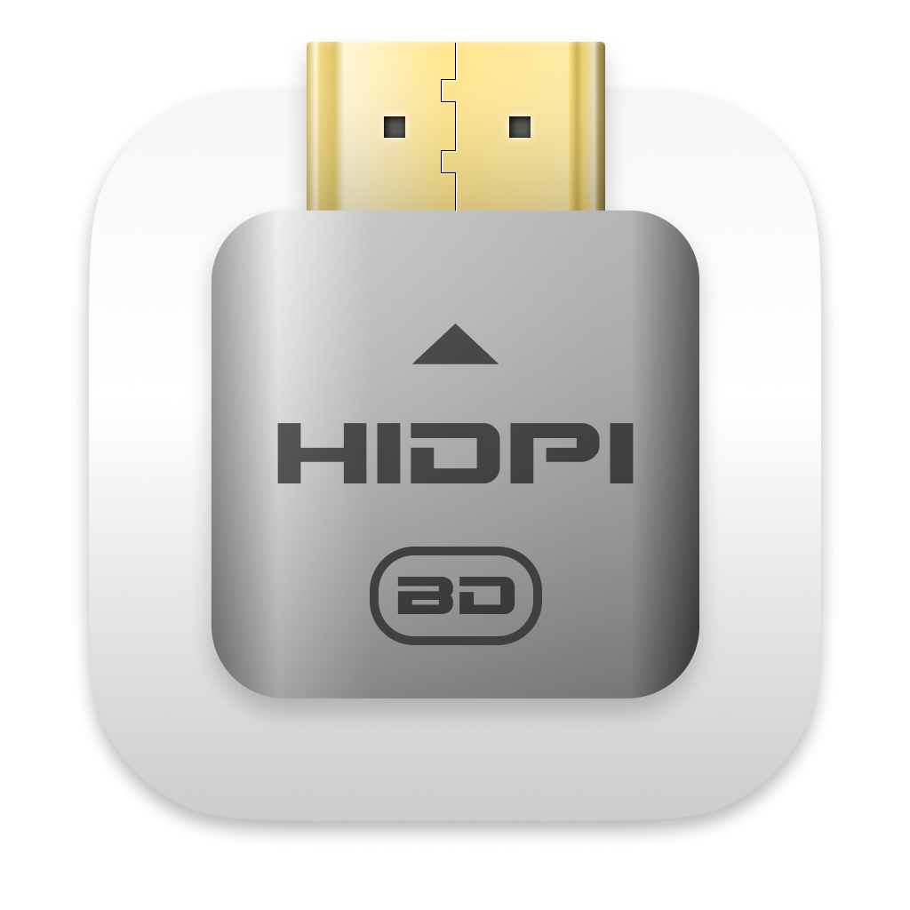

# ResolutionUnlocker

**Unlock crisp, custom HiDPI resolutions on external displays for Apple Silicon Macs.**

Large and ultrawide monitors often don't offer sharp, correctly-scaled ("HiDPI" / Retina-like)
resolutions when connected to an Apple Silicon Mac — so text ends up either tiny or blurry.
ResolutionUnlocker creates a hidden virtual display that you mirror to your real monitor, which
makes macOS expose the custom HiDPI scaled resolutions it otherwise hides.

<br clear="left"/>

## What it does

- Adds custom HiDPI (scaled) resolutions for external monitors, including large/ultrawide panels.
- Lives in the menu bar: create a virtual "dummy" display, pick an aspect ratio and resolution,
  and associate/mirror it to your monitor.
- No account, no telemetry — nothing leaves your machine.

## Source & credit

ResolutionUnlocker is an MIT-licensed **fork of [BetterDummy](https://github.com/waydabber/BetterDummy)
by waydabber (Istvan T.)**. All credit for the original application goes to the upstream author.
The original copyright is retained in [`LICENSE`](LICENSE).

### What's different in this fork

- Upgraded Sparkle to 2.9.5 and **removed the auto-update feed** (this fork hosts no appcast).
- Security hardening; automatic update checks disabled by default.
- Bug fixes — display-mode zero/negative-count crash guard, and multi-refresh-rate mode
  construction — each covered by tests.
- Dependency-injection refactors that make the display/mode logic unit-testable, plus a test suite.

## Building

Open `ResolutionUnlocker.xcodeproj` in Xcode and build the **ResolutionUnlocker** scheme, or:

```sh
xcodebuild -project ResolutionUnlocker.xcodeproj -scheme ResolutionUnlocker -configuration Release \
  build CODE_SIGNING_ALLOWED=NO
```

The app relies on private macOS display APIs and is unsigned / not notarized — build it yourself
and run it locally.

## Tests

```sh
xcodebuild test -project ResolutionUnlocker.xcodeproj -scheme ResolutionUnlockerTests -destination 'platform=macOS' \
  CODE_SIGN_IDENTITY="-" CODE_SIGNING_REQUIRED=NO CODE_SIGNING_ALLOWED=YES ENABLE_HARDENED_RUNTIME=NO
```

## Support

If you find this useful, you can [sponsor me on GitHub](https://github.com/sponsors/jm-armijo).

## License

MIT — see [`LICENSE`](LICENSE). Original work © 2021 Istvan T. (waydabber).
